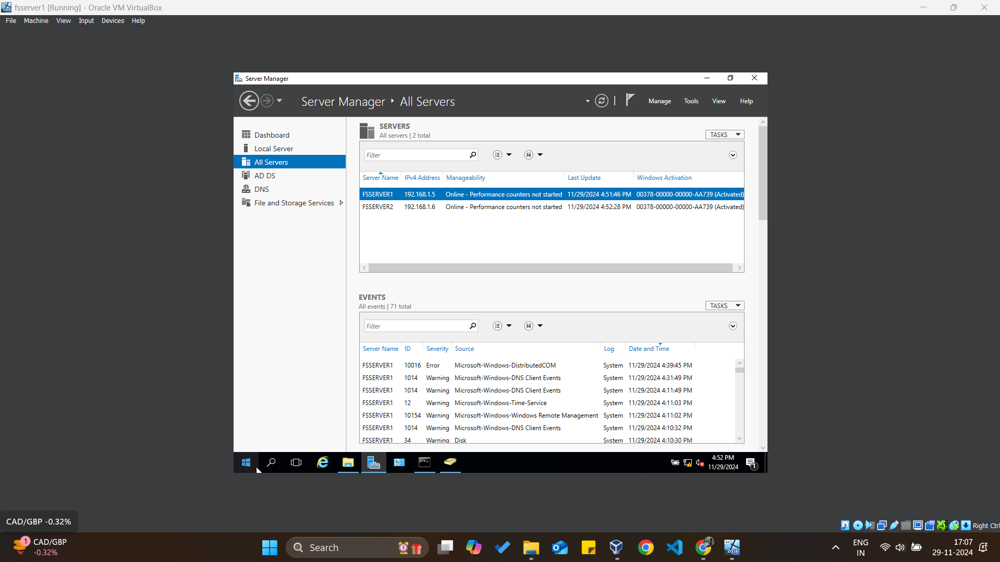
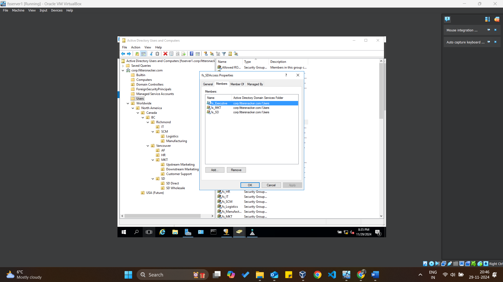

# Project FitterSnacker: A Virtual Enterprise Network Implementation 

### **Introduction**

**Purpose:** This project demonstrates the implementation of a Windows-based client/server environment for the fictitious company, Fitter Snacker. It was developed as part of the INFO 2416 course at Kwantlen Polytechnic University to modernize Fitter Snacker’s IT infrastructure by setting up Active Directory, DNS, DHCP, file sharing, and hosting a secure website using IIS with HTTPS.

Fitter Snacker, a BC-based company producing nutritious snack bars, required an overhaul of their IT environment to enhance efficiency, secure their network, and establish a strong technological foundation for potential expansion into the U.S. market. The project involved setting up virtual servers and a client network to create a centralized and secure domain environment.

---

### **Introduction**

Fitter Snacker is a small BC-based company that makes healthy snack bars. The company currently does everything using individual independent workstations and paper. Although they have enjoyed success, competition is growing in this sector and they have realized that in order to remain competitive, they need to invest in Information Technology. Fitter Snacker does not even have a website! They have come to you to help them design and implement a client/server environment that will modernize the business and allow them to invest in information systems that will make their business processes more efficient.

---

### **Requirements**

You have met with Norman Geekly (CIO) and Billy Kidd (Sr. Manager, IT) and identified the requirements for the client/server environment.

#### **Implementation Environment**
- Utilize Oracle’s VirtualBox hypervisor as the main platform for this project.

#### **Host-Only Network**
- Set up a Host-Only Network in VirtualBox with:
  - **IPV4 Network Address:** 192.168.1.1/24
  - **IPV4 Network Mask:** 255.255.255.0
- Ensure the VirtualBox DHCP server is disabled as you will be installing the DHCP role on one of the server VMs.

#### **Domain**
- **Registered Domain:** fittersnacker.com
- **Environment Domain:** corp.fittersnacker.com
- **NetBIOS Domain Name:** FITTER

---

### **Servers**

#### **Server VM#1**
- **Name:** fsserver1
- **Operating System:** Windows Server 2016, Desktop Experience
- **Memory:** 1536 MB (minimum 1024 MB)
- **Disk:** 30 GB
- **Static IP Address:** 192.168.1.5
- **Roles:**
  - Directory Server (AD DS)
  - DNS Server
  - File Server
  - Web Server

#### **Server VM#2**
- **Name:** fsserver2
- **Operating System:** Windows Server 2016, Desktop Experience
- **Memory:** 1536 MB (minimum 1024 MB)
- **Disk:** 30 GB
- **Static IP Address:** 192.168.1.6
- **Roles:**
  - DHCP Server
  - File Server
  - Print Server

---

### **Clients**

Although Fitter Snacker will have many client computers, you will implement one virtual client from scratch using Windows 10 32-bit with the following specifications:

- **Name:** fsclient1
- **Operating System:** Windows 10 32-bit
- **Memory:** 768 MB (minimum 512 MB)
- **Disk:** 20 GB
- **IP Address:** Automatically assigned by the DHCP server

---

### **Background**

Fitter Snacker manufactures and sells two types of nutritious snack bars: **NRG-A** and **NRG-B**.
- The NRG-A bar provides “advanced energy.”
- The NRG-B bar provides “body-building proteins.”

The company is located in the lower mainland and consists of six main functional groups:
1. Marketing (MKT)
2. Sales (SD)
3. Supply Chain Management (SCM)
4. Accounting and Finance (A/F)
5. Human Resources (HR)
6. Information Technology (IT)

At the executive level, there are four executive positions:
1. **Chief Executive Officer (CEO)** – Arnold Terminator occupies this highest-ranking position of the company and is responsible for the overall operations and resources of the company. All senior executives report to Arnold.
2. **Chief Financial Officer (CFO)** – Donald Dollars is responsible for managing all the financial activities of the company. Donald oversees the A/F and HR functional groups.
3. **Chief Information Officer (CIO)** – Norman Geekly manages and implements the company’s information and computer technologies. Norman oversees the IT and SCM functional groups.
4. **Chief Marketing Officer (CMO)** – Joe Smoothie plans and implements the business’s overall marketing strategy. Joe oversees the MKT and SD functional groups.

The overall organization structure is as follows:
- A senior manager oversees each major functional group.
- A manager oversees subordinate functional areas, if they exist.
- In total, there are 37 people in Fitter Snacker.

---

### **Current State and Expansion Plans**

- Fitter Snacker currently has two offices:
  - **Richmond Office:** Houses IT and SCM.
  - **Surrey Office:** Houses A/F, HR, MKT, and SD.
- The executive team is located in the Surrey office, except for Norman Geekly, who resides in the Richmond facility.

**Expansion Plans:**
- Currently sells only to customers in Canada.
- Planning to expand to the USA with a new office in Seattle.
- No plans for international expansion beyond the USA.

**Network Infrastructure:**
- The network between the facilities is robust with high bandwidth and very low latency.
- The Richmond office has a secure and resilient server room that will house all the servers for the client/server system designed and implemented in this project.


---

### **Features**
- **Active Directory (AD) Setup:**
  - Automated creation of Organizational Units (OUs), users, and security groups using PowerShell.
  - Comprehensive OU structure to reflect organizational hierarchy.

- **DHCP and DNS Configuration:**
  - Dynamic IP address allocation through a configured DHCP server.
  - DNS setup with forward and reverse lookup zones for network resolution.

- **File Server:**
  - Shared folders with NTFS and share-level permissions for department-specific access.

- **Group Policy Objects (GPOs):**
  - Enforced policies like restricting Task Manager access for specific groups.

- **Web Server with HTTP:**
  - IIS hosting for the company website secured with HTTP using a self-signed SSL certificate.

---

### **Files and Scripts**
- **Configurations/:**
  - `dhcp_scope_config.xml`: XML file defining the DHCP scope.
  - `ad_users_powershell.ps1`: PowerShell script for automating AD setup.
  - `iis_site_config.xml`: IIS configuration file with bindings and virtual directory setup.

- **Website/:**
  - `index.html`: Homepage for the Fitter Snacker website.
  - `style.css`: Stylesheet for the website.

- **Documentation/:**
  - `Project_Report.pdf`: Detailed documentation covering project implementation, results, and challenges.
  - `README.md`: This file.

---

### **Steps for Implementation**

#### **1. Active Directory Setup**
- **Script:** `ad_users_powershell.ps1`
  - Automates creation of OUs, users, and security groups.
  - Includes error handling and logging for validation.
- **Validation:**
  - Use "Active Directory Users and Computers" to verify OUs, users, and group memberships.

#### **2. DHCP and DNS Configuration**
- **File:** `dhcp_scope_config.xml`
  - Configures DHCP scope for IP address assignment.
- **Validation:**
  - Test DHCP by connecting a client to the network and verifying IP allocation.
  - Use `nslookup` to confirm DNS resolution.

#### **3. IIS Web Server with HTTPS**
- **File:** `iis_site_config.xml`
  - Configures IIS with HTTPS binding and virtual directory.
- **SSL Setup:**
  - Generate a self-signed SSL certificate using PowerShell:
    ```
    New-SelfSignedCertificate -DnsName "www.fittersnacker.com" -CertStoreLocation "cert:\LocalMachine\My"
    ```
  - Bind the certificate to the site in IIS.

#### **4. File Server Configuration**
- Create shared folders for departments (e.g., HR, IT, SCM).
- Assign permissions using NTFS and share-level settings based on security groups.

#### **5. Group Policy Objects (GPOs)**
- Restrict Task Manager access for executives using a GPO:
  - Use the "Group Policy Management" console to configure and enforce settings.

---

### **Demonstration**

#### **Screenshots**
All screenshots are available in the `img` directory, named sequentially. Below are descriptions of each:

1. **VirtualBox Host-Only DHCP Server Settings**
   - 
   - Shows the Host-Only Network with the network address `192.168.1.1/24` and DHCP disabled.

2. **Server VM#1 Hardware Settings**
   - 
   - Shows fsserver1 hardware settings (memory, processor, disk) in VirtualBox.

3. **Server VM#1 Login Screen**
   - 
   - Shows the login screen of fsserver1 with NetBIOS name `FITTER\Administrator` and password prompt.

4. **Server VM#2 Hardware Settings**
   - 
   - Shows fsserver2 hardware settings in VirtualBox.

5. **Server VM#2 Join Domain**
   - 
   - Shows the login screen of fsserver2 after joining the corp.fittersnacker.com domain.

6. **Verification of Ping and Network Visibility**
   - 
   - Shows a successful ping from fsserver2 to fsserver1 and visibility of both servers in File Explorer → Network.

7. **DHCP Scope in Server Manager (fsserver1)**
   - 
   - Shows the DHCP scope configuration on fsserver1 with host IDs 180–200.

8. **DHCP Scope Verification (fsserver2)**
   - 
   - Shows the DHCP scope on fsserver2 created from fsserver1.

9. **Client VM IP Address Verification**
   - 
   - Shows the ipconfig /all output on fsclient1 with the DHCP-assigned IP address and correct DNS/DHCP configurations.

10. **DNS Configuration Verification**
    - 
    - Shows the nslookup results on fsserver2 for both forward and reverse lookups.

11. **List of Users in AD**
    - 
    - 
    - Shows all 37 users created in Active Directory, sorted by the "Type" column.

12. **Domain Admin Group Members**
    - 
    - Shows the members of the Domain Admins group.

13. **List of Organizational Units (OUs)**
    - 
    - Shows the complete OU structure as described (e.g., Worldwide, North America, Canada).

14. **Security Groups**
    - 
    - 
    - Shows all security groups (fs_Executive, fs_Manufacturing, etc.) created in AD.

15. **Manufacturing Group Members**
    - 
    - Shows the members of the fs_Manufacturing security group.

16. **SD Access Group Members**
    - 
    - Shows the members of the fs_SDAccess domain local group.

17. **File Share Access (CEO)**
    - 
    - Shows Arnold Terminator accessing the IT share.

18. **File Share Access (IT Manager)**
    - 
    - Shows Billy Kidd accessing the IT share.

19. **File Share Access (Manufacturing Employee)**
    - 
    - Shows Alvin Smith accessing the SCM share.

20. **Group Policy Overview**
    - 
    - Shows the Remove Task Manager Group Policy Object applied to fs_Executive.

21. **CEO Task Manager Disabled**
    - 
    - Shows Arnold Terminator attempting to open Task Manager and receiving the error message.

22. **IT Manager Task Manager Enabled**
    - 
    - Shows Billy Kidd successfully running Task Manager.

23. **Print Management Console**
    - 
    - 
    - Shows the Executive Printer, AF Printer, and Common Printer added in Print Management on fsserver2.

24. **Fitter Snacker Website**
    - 
    - 
    - 
    - 
    - Shows the Fitter Snacker homepage accessed via Internet Explorer on fsserver2.


---

### **Reflection Questions**
1. **What was the easiest part of this project?**
   - Configuring IIS and hosting the website was straightforward.

2. **What was the most challenging aspect?**
   - Automating user creation while ensuring error handling for duplicates.

3. **How does DHCP enhance network management?**
   - Automates IP allocation, reducing manual configuration effort.

4. **Why is HTTPS important for the web server?**
   - Encrypts communication, ensuring data confidentiality and integrity.

---

### **Conclusion**
This project successfully demonstrates the implementation of a client/server environment for Fitter Snacker. By automating Active Directory setup, configuring network services, and securing the web server with HTTP, this project highlights the efficiency and security of modern IT environments.

---

### **Credits**
- **Author:** Sukhdeep Singh(Student ID: 100447918)
- **Email:** sukhdeep.atwork@gmail.com
- **Institution:** Kwantlen Polytechnic University
- **Textbook:** Fitter Snacker is a fictitious company that is described in a textbook used for INFO 3240, namely *Concepts Enterprise Resource Planning* by Ellen Monk and Bret Wagner, 4th edition. 
- **Instructor:** Prof. Warren Edwards

